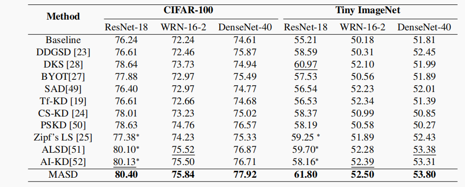

# Boosting Accuracy of Student Models via Masked Adaptive Self-Distillation

This repository is the official PyTorch implementation of Boosting Accuracy of Student Models via Masked Adaptive Self-Distillation.


## Installation and Requirements

### System Requirements

- Ubuntu 18.04 LTS
- python 3.8 (Anaconda recommended)
- CUDA 11.1
- PyTorch 1.12 + torchvision 0.13

### Installation

Run the following command to install the required dependencies:

``` python
pip install -r requirements.txt
```

## Reproducing the Baseline from Figure 2

### 1）Update the dataset path

``` python
root='path/to/dataset/' 
```

### 2）Update the checkpoint path

``` python
checkpoint_path = "path/to/checkpoint.pth.tar"
```

Replace "path/to/checkpoint.pth.tar" with the actual path to:
CIFAR-100_arch_CIFAR_ResNet18_cross_entropy/CIFAR_ResNet18_best.pth.tar

### 3）Run the Code

To run the code, simply execute the following command:

``` python
python main.py 
```

## Reproduce the results on TinyImageNet



### 1）Prepare the Tiny ImageNet dataset

Run the command `python dataloader/tiny_imagenet.py`. By default, Tiny ImageNet will be saved to the directory `./tiny-imagenet`.

### 2）Runing MASD

``` python
python train.py --gpu 0 --dataset TinyImageNet --data ./tiny-imagenet/ --arch CIFAR_ResNet18_masd --method MASD --batch-size 128 --weight-decay 1e-4
```
